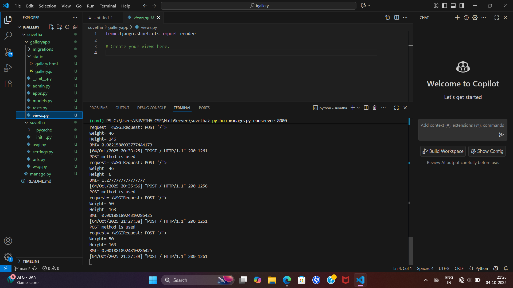

# Ex.05 Design a Website for Server Side Processing
## Date:1/10/25

## AIM:
 To design a website to calculate the power of a lamp filament in an incandescent bulb in the server side. 


## FORMULA:
BMI = W/H<sup>2</sup>R
<br> BMI --> Body Mass Index
<br> W --> Weight
<br> H --> Height

## DESIGN STEPS:

### Step 1:
Clone the repository from GitHub.

### Step 2:
Create Django Admin project.

### Step 3:
Create a New App under the Django Admin project.

### Step 4:
Create python programs for views and urls to perform server side processing.

### Step 5:
Create a HTML file to implement form based input and output.

### Step 6:
Publish the website in the given URL.

## PROGRAM :

```
math.html

<html>
<head>
<title>Body Mass Index</title>
<h1 style="color:pink;">SUVETHA k (25014616)</h1>
<style type="text/css">
body
{
background-color:red;
}
.edge {
width: 1440px;
margin-left: auto;
margin-right: auto;
padding-top: 250px;
padding-left: 300px;
}
.box {
display:block;
border: Thick dashed lime;
width: 500px;
min-height: 300px;
font-size: 20px;
background-color:blue;
}
.formelt{
  color:orange;
  text-align: center;
  margin-top: 7px;
  margin-bottom: 6px;
}
h1
{
color:rgb(255, 0, 179);
text-align: center;
padding-top: 20px;
}
</style>
</head>
<body>
  <div class="edge">
  <div class="box">
  <h1>Body Mass Index</h1>

  <form method="POST">
  
  <div class="formelt">
    Weight:<input type="text" name="Weight" value="{{w}}"></input>(in kg)<br/>

  <div class="formelt">
    Height:<input type="text" name="Height" value="{{h}}"></input>(in m)<br/>
  </div>
  <div class="formelt">
    <input type="submit" value="Calculate"></input><br/>
  </div>
  <div class="formelt">
    BMI:<input type="text" name="BMI" value="{{bmi}}"></input>kg/m<sup>2</sup><br/>
  </div>
  </form>
  </div>
  </div>
</body>
</html>
    

views.py

from django.shortcuts import render
def bmi(request):
    context={}
    context['bmi'] = "0"
    context['w'] = "0"
    context['h'] = "0"
    if request.method == 'POST':
        print("POST method is used")
        w = request.POST.get('Weight','w')
        h = request.POST.get('Height','h')
        print('request=',request)
        print('Weight=',w)
        print('Height=',h)
        a = int(w)
        b = int(h)
        bmi = a/(b*b)
        context['bmi'] = bmi
        context['w'] = w
        context['h'] = h
        print('BMI=',bmi)
    return render(request,'mathapp/math.html',context)

urls.py

from django.contrib import admin
from django.urls import path
from mathapp import views
urlpatterns = [
    path('admin/', admin.site.urls),
    path('bodymassindex',views.bmi,name="bodymassindex"),
    path('',views.bmi,name="bodymassindexroot")
]

```


## SERVER SIDE PROCESSING:



## HOMEPAGE:

.png>)


## RESULT:
The program for performing server side processing is completed successfully.
